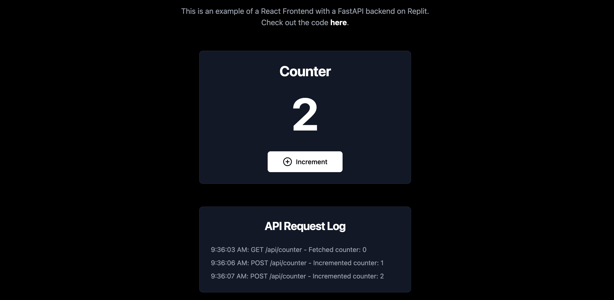

# Fullstack Repl Example

A full-stack application demonstrating the integration of a React frontend with a FastAPI backend on Replit.

To get started, just click "Run." Or check out the live demo [here](https://matts-single-fullstack-repl.replit.app/).

## API Endpoints

- GET `/api/counter`: Retrieve the current counter value
- POST `/api/counter`: Increment the counter

## Deployment

The app is configured for easy deployment on Replit. The backend serves the built frontend files in production.